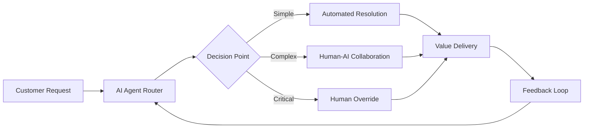

# Enhanced Enterprise Agentic AI Blueprint v2.0
## Comprehensive Framework for Financial Institutions

---

## Table of Contents

### Part I: Foundational Components
1. [Executive Summary](#executive-summary)
2. [Strategic Alignment](#strategic-alignment)
3. [Cognitive Architecture](#cognitive-architecture)
4. [Memory Systems](#memory-systems)
5. [Reasoning Frameworks](#reasoning-frameworks)

### Part II: Critical Infrastructure
6. [Model Lifecycle Management](#model-lifecycle-management)
7. [Ethical AI Framework](#ethical-ai-framework)
8. [Regulatory Compliance Engine](#regulatory-compliance-engine)
9. [Human-AI Collaboration Model](#human-ai-collaboration)
10. [Continuous Learning System](#continuous-learning-system)

### Part III: Advanced Capabilities
11. [Multi-Agent Orchestration](#multi-agent-orchestration)
12. [Cognitive Load Balancing](#cognitive-load-balancing)
13. [Fail-Safe Mechanisms](#fail-safe-mechanisms)
14. [Observability & Explainability](#observability-explainability)
15. [Performance Optimization](#performance-optimization)

### Part IV: Enterprise Integration
16. [Legacy System Integration](#legacy-system-integration)
17. [Data Governance Framework](#data-governance)
18. [Change Management Strategy](#change-management)
19. [Cost Optimization](#cost-optimization)
20. [Success Metrics & KPIs](#success-metrics)

---

## Executive Summary

This enhanced blueprint represents a comprehensive framework for implementing enterprise-grade agentic AI in financial institutions. It incorporates cutting-edge cognitive architectures, robust governance frameworks, and proven implementation strategies from leading organizations.

### Key Differentiators
- **Cognitive Architecture**: Advanced reasoning with ReAct, Chain-of-Thought, and Tree-of-Thoughts
- **Memory Systems**: Hierarchical memory with episodic, semantic, and procedural components
- **Ethical Framework**: Built-in bias detection, fairness metrics, and explainability
- **Regulatory Engine**: Real-time compliance monitoring across multiple jurisdictions
- **Human-AI Teaming**: Sophisticated collaboration models with clear handoff protocols

---

## Part I: Foundational Components

## Strategic Alignment

### Business Objectives Mapping

```yaml
strategic_alignment:
  business_goals:
    - revenue_growth:
        target: "15% YoY"
        ai_contribution:
          - automated_trading: "5%"
          - risk_optimization: "4%"
          - customer_acquisition: "6%"
    
    - cost_reduction:
        target: "30% operational costs"
        ai_contribution:
          - process_automation: "15%"
          - decision_optimization: "10%"
          - resource_allocation: "5%"
    
    - risk_mitigation:
        target: "50% reduction in compliance violations"
        ai_contribution:
          - real_time_monitoring: "20%"
          - predictive_analytics: "20%"
          - automated_reporting: "10%"
    
    - customer_satisfaction:
        target: "NPS > 70"
        ai_contribution:
          - personalization: "25 points"
          - response_time: "15 points"
          - accuracy: "10 points"
```

### Value Stream Mapping



---

## Cognitive Architecture

### Advanced Reasoning Framework

```python
class CognitiveArchitecture:
    """
    Enterprise Cognitive Architecture for Financial AI Agents
    Implements ReAct, CoT, and ToT reasoning patterns
    """
    
    def __init__(self):
        self.reasoning_engines = {
            "react": ReActEngine(),
            "chain_of_thought": ChainOfThoughtEngine(),
            "tree_of_thoughts": TreeOfThoughtsEngine(),
            "constitutional_ai": ConstitutionalAIEngine()
        }
        self.memory_system = HierarchicalMemorySystem()
        self.attention_mechanism = MultiHeadAttention()
        self.metacognition = MetacognitiveController()
    
    async def reason(self, task: Task, context: Context) -> Decision:
        """
        Multi-strategy reasoning with automatic strategy selection
        """
        # Metacognitive assessment
        complexity = self.metacognition.assess_complexity(task)
        criticality = self.metacognition.assess_criticality(task)
        
        # Strategy selection
        if criticality > 0.8:
            # High criticality: Use Tree of Thoughts for exhaustive exploration
            strategy = "tree_of_thoughts"
        elif complexity > 0.7:
            # High complexity: Use Chain of Thought for step-by-step reasoning
            strategy = "chain_of_thought"
        else:
            # Standard: Use ReAct for action-oriented reasoning
            strategy = "react"
        
        # Execute reasoning
        reasoning_trace = await self.reasoning_engines[strategy].process(
            task=task,
            context=context,
            memory=self.memory_system.retrieve(task)
        )
        
        # Constitutional AI check
        validated_trace = await self.reasoning_engines["constitutional_ai"].validate(
            reasoning_trace,
            principles=self.get_constitutional_principles()
        )
        
        # Generate decision with confidence scoring
        decision = self.synthesize_decision(validated_trace)
        
        # Store in memory for future reference
        self.memory_system.store(task, decision, reasoning_trace)
        
        return decision
```

### ReAct (Reasoning + Acting) Pattern

```python
class ReActEngine:
    """
    Implements ReAct pattern for interleaved reasoning and acting
    """
    
    async def process(self, task: Task, context: Context, memory: Memory) -> ReasoningTrace:
        trace = ReasoningTrace()
        max_iterations = 10
        
        for i in range(max_iterations):
            # Thought: Reason about the current state
            thought = await self.think(task, context, trace.get_history())
            trace.add_thought(thought)
            
            # Check if task is complete
            if self.is_complete(thought):
                break
            
            # Action: Decide and execute next action
            action = await self.act(thought, context)
            trace.add_action(action)
            
            # Observation: Observe the result
            observation = await self.observe(action)
            trace.add_observation(observation)
            
            # Update context with new information
            context.update(observation)
        
        return trace
```

### Chain-of-Thought (CoT) Implementation

```python
class ChainOfThoughtEngine:
    """
    Implements Chain-of-Thought reasoning for complex problem solving
    """
    
    async def process(self, task: Task, context: Context, memory: Memory) -> ReasoningTrace:
        trace = ReasoningTrace()
        
        # Decompose problem
        steps = await self.decompose_problem(task)
        
        # Process each step with explicit reasoning
        for step in steps:
            # Generate reasoning for this step
            reasoning = await self.reason_step(step, context, trace.get_history())
            trace.add_step(step, reasoning)
            
            # Validate reasoning
            if not self.validate_reasoning(reasoning):
                # Backtrack and try alternative approach
                alternative = await self.generate_alternative(step, context)
                trace.add_alternative(step, alternative)
                reasoning = alternative
            
            # Update context with step results
            context.update(reasoning.conclusion)
        
        # Synthesize final answer
        final_answer = await self.synthesize(trace)
        trace.set_conclusion(final_answer)
        
        return trace
```

### Tree-of-Thoughts (ToT) Framework

```python
class TreeOfThoughtsEngine:
    """
    Implements Tree-of-Thoughts for exploring multiple reasoning paths
    """
    
    async def process(self, task: Task, context: Context, memory: Memory) -> ReasoningTrace:
        # Initialize tree with root node
        root = ThoughtNode(task, context)
        tree = ThoughtTree(root)
        
        # Set exploration parameters
        beam_width = 5
        max_depth = 7
        
        # Explore tree using beam search
        for depth in range(max_depth):
            # Get current frontier
            frontier = tree.get_frontier(beam_width)
            
            if not frontier:
                break
            
            # Expand each node in frontier
            for node in frontier:
                # Generate possible next thoughts
                thoughts = await self.generate_thoughts(node)
                
                # Evaluate each thought
                for thought in thoughts:
                    score = await self.evaluate_thought(thought, task)
                    child = ThoughtNode(thought, node.context, score)
                    tree.add_child(node, child)
                
                # Prune low-scoring branches
                tree.prune(threshold=0.3)
            
            # Check for solution
            if tree.has_solution():
                break
        
        # Extract best path
        best_path = tree.get_best_path()
        return self.path_to_trace(best_path)
```

---

## Memory Systems

### Hierarchical Memory Architecture

```python
class HierarchicalMemorySystem:
    """
    Multi-tier memory system for financial AI agents
    """
    
    def __init__(self):
        self.working_memory = WorkingMemory(capacity=7)  # Miller's Law
        self.episodic_memory = EpisodicMemory()
        self.semantic_memory = SemanticMemory()
        self.procedural_memory = ProceduralMemory()
        self.prospective_memory = ProspectiveMemory()  # For future tasks
        
    async def store(self, experience: Experience):
        """Store experience in appropriate memory systems"""
        
        # Always in working memory first
        self.working_memory.add(experience)
        
        # Episodic: Store specific events
        if experience.is_significant():
            await self.episodic_memory.encode(experience)
        
        # Semantic: Extract and store facts
        facts = self.extract_facts(experience)
        for fact in facts:
            await self.semantic_memory.add_fact(fact)
        
        # Procedural: Learn from successful actions
        if experience.has_successful_action():
            procedure = self.extract_procedure(experience)
            await self.procedural_memory.learn(procedure)
        
        # Prospective: Set reminders for future
        if experience.has_future_implications():
            reminder = self.create_reminder(experience)
            await self.prospective_memory.schedule(reminder)
    
    async def retrieve(self, query: Query) -> MemorySet:
        """Retrieve relevant memories for decision making"""
        
        memories = MemorySet()
        
        # Check working memory first (fastest)
        working = self.working_memory.search(query)
        memories.add(working, priority=1.0)
        
        # Retrieve from long-term stores
        episodic = await self.episodic_memory.recall(query)
        semantic = await self.semantic_memory.query(query)
        procedural = await self.procedural_memory.match(query)
        
        memories.add(episodic, priority=0.8)
        memories.add(semantic, priority=0.7)
        memories.add(procedural, priority=0.9)
        
        # Check for scheduled reminders
        reminders = await self.prospective_memory.check(query.context)
        memories.add(reminders, priority=0.6)
        
        return memories
```

### Memory Consolidation

```python
class MemoryConsolidation:
    """
    Consolidate and optimize memory storage
    Similar to human sleep consolidation
    """
    
    async def consolidate(self):
        """Run memory consolidation process"""
        
        # Transfer important items from working to long-term memory
        important_items = self.working_memory.get_important()
        for item in important_items:
            await self.transfer_to_longterm(item)
        
        # Compress episodic memories into semantic knowledge
        episodes = await self.episodic_memory.get_old_episodes()
        knowledge = self.extract_patterns(episodes)
        await self.semantic_memory.integrate(knowledge)
        
        # Optimize procedural memory
        procedures = await self.procedural_memory.get_all()
        optimized = self.optimize_procedures(procedures)
        await self.procedural_memory.update(optimized)
        
        # Garbage collection
        await self.remove_redundant_memories()
        await self.merge_similar_memories()
```

---

## Reasoning Frameworks

### Constitutional AI Implementation

```python
class ConstitutionalAIEngine:
    """
    Ensures AI decisions align with organizational principles
    """
    
    def __init__(self):
        self.principles = self.load_constitutional_principles()
        self.validators = self.initialize_validators()
    
    def load_constitutional_principles(self) -> List[Principle]:
        """Load organizational constitutional AI principles"""
        return [
            Principle(
                name="Fairness",
                description="Treat all customers equitably",
                validator=FairnessValidator(),
                weight=0.9
            ),
            Principle(
                name="Transparency",
                description="Decisions must be explainable",
                validator=TransparencyValidator(),
                weight=0.8
            ),
            Principle(
                name="Privacy",
                description="Protect customer data",
                validator=PrivacyValidator(),
                weight=1.0
            ),
            Principle(
                name="Compliance",
                description="Adhere to all regulations",
                validator=ComplianceValidator(),
                weight=1.0
            ),
            Principle(
                name="Beneficence",
                description="Act in customer's best interest",
                validator=BeneficenceValidator(),
                weight=0.85
            )
        ]
    
    async def validate(self, decision: Decision) -> ValidationResult:
        """Validate decision against constitutional principles"""
        
        results = []
        for principle in self.principles:
            result = await principle.validator.check(decision)
            results.append(result)
            
            # Hard stop on critical violations
            if not result.passed and principle.weight >= 1.0:
                return ValidationResult(
                    passed=False,
                    reason=f"Violates {principle.name}: {result.reason}",
                    suggestions=result.suggestions
                )
        
        # Calculate weighted score
        score = sum(r.score * p.weight for r, p in zip(results, self.principles))
        threshold = 0.8
        
        return ValidationResult(
            passed=score >= threshold,
            score=score,
            details=results
        )
```

---

## Part II: Critical Infrastructure

## Model Lifecycle Management

### MLOps for Agentic AI

```yaml
model_lifecycle:
  stages:
    development:
      - experimentation:
          tools: ["mlflow", "wandb", "tensorboard"]
          version_control: "dvc"
          collaboration: "github"
      
      - training:
          infrastructure: "kubernetes"
          frameworks: ["pytorch", "tensorflow", "jax"]
          distributed: true
          
    validation:
      - testing:
          unit_tests: true
          integration_tests: true
          performance_tests: true
          security_tests: true
      
      - evaluation:
          metrics: ["accuracy", "fairness", "robustness", "explainability"]
          benchmarks: ["financial_qa", "risk_assessment", "compliance_check"]
          
    deployment:
      - staging:
          canary_deployment: true
          a_b_testing: true
          shadow_mode: true
      
      - production:
          blue_green_deployment: true
          rollback_capability: true
          monitoring: "real_time"
          
    monitoring:
      - performance:
          latency: "p50, p95, p99"
          throughput: "requests_per_second"
          error_rate: "percentage"
      
      - drift_detection:
          data_drift: true
          concept_drift: true
          performance_drift: true
          
    maintenance:
      - retraining:
          trigger: ["drift_detected", "scheduled", "performance_degradation"]
          automated: true
      
      - versioning:
          model_registry: "mlflow"
          artifact_storage: "s3"
          metadata_tracking: true
```

### Model Registry Implementation

```python
class ModelRegistry:
    """
    Centralized model registry for agentic AI models
    """
    
    def __init__(self):
        self.models = {}
        self.versions = {}
        self.deployments = {}
        self.metrics = {}
        
    async def register_model(self, model: Model) -> str:
        """Register a new model with comprehensive metadata"""
        
        model_id = self.generate_model_id(model)
        
        # Store model artifacts
        await self.store_artifacts(model_id, model.artifacts)
        
        # Store metadata
        metadata = {
            "id": model_id,
            "name": model.name,
            "version": model.version,
            "type": model.type,
            "framework": model.framework,
            "created_at": datetime.now(),
            "created_by": model.creator,
            "description": model.description,
            "tags": model.tags,
            "performance_metrics": model.metrics,
            "training_data": model.training_data_hash,
            "hyperparameters": model.hyperparameters,
            "dependencies": model.dependencies,
            "ethical_review": model.ethical_review_status,
            "compliance_check": model.compliance_status
        }
        
        self.models[model_id] = metadata
        
        # Version tracking
        self.track_version(model_id, model.version)
        
        # Lineage tracking
        await self.track_lineage(model_id, model.parent_models)
        
        return model_id
    
    async def deploy_model(self, model_id: str, environment: str) -> Deployment:
        """Deploy model with safety checks"""
        
        # Pre-deployment validation
        validation = await self.validate_for_deployment(model_id)
        if not validation.passed:
            raise DeploymentError(validation.reason)
        
        # Create deployment
        deployment = Deployment(
            model_id=model_id,
            environment=environment,
            timestamp=datetime.now(),
            config=self.get_deployment_config(environment)
        )
        
        # Shadow deployment first
        if environment == "production":
            shadow = await self.shadow_deploy(model_id)
            await self.monitor_shadow(shadow, duration_hours=24)
            
            if not shadow.metrics_acceptable():
                raise DeploymentError("Shadow deployment metrics below threshold")
        
        # Actual deployment
        await self.execute_deployment(deployment)
        
        # Post-deployment monitoring
        self.start_monitoring(deployment)
        
        return deployment
```

---

## Ethical AI Framework

### Bias Detection and Mitigation

```python
class BiasDetectionSystem:
    """
    Comprehensive bias detection and mitigation for financial AI
    """
    
    def __init__(self):
        self.detectors = {
            "demographic": DemographicBiasDetector(),
            "historical": HistoricalBiasDetector(),
            "representation": RepresentationBiasDetector(),
            "aggregation": AggregationBiasDetector(),
            "evaluation": EvaluationBiasDetector()
        }
        self.mitigators = {
            "reweighting": ReweightingMitigator(),
            "resampling": ResamplingMitigator(),
            "adversarial": AdversarialDebiasing(),
            "calibration": CalibrationMitigator()
        }
    
    async def analyze(self, model: Model, data: Dataset) -> BiasReport:
        """Comprehensive bias analysis"""
        
        report = BiasReport()
        
        # Run all detectors
        for name, detector in self.detectors.items():
            bias_metrics = await detector.detect(model, data)
            report.add_section(name, bias_metrics)
        
        # Calculate overall bias score
        report.overall_score = self.calculate_bias_score(report)
        
        # Generate recommendations
        if report.overall_score > 0.2:  # Threshold for concern
            recommendations = await self.generate_recommendations(report)
            report.recommendations = recommendations
        
        return report
    
    async def mitigate(self, model: Model, bias_report: BiasReport) -> Model:
        """Apply bias mitigation strategies"""
        
        mitigated_model = model.copy()
        
        for bias_type, metrics in bias_report.get_significant_biases():
            # Select appropriate mitigator
            mitigator = self.select_mitigator(bias_type, metrics)
            
            # Apply mitigation
            mitigated_model = await mitigator.apply(
                mitigated_model,
                bias_type,
                metrics
            )
            
            # Verify improvement
            new_metrics = await self.detectors[bias_type].detect(
                mitigated_model,
                model.validation_data
            )
            
            if not self.is_improved(metrics, new_metrics):
                # Try alternative mitigation
                alternative = self.get_alternative_mitigator(bias_type)
                mitigated_model = await alternative.apply(
                    model,
                    bias_type,
                    metrics
                )
        
        return mitigated_model
```

### Fairness Metrics

```python
class FairnessMetrics:
    """
    Comprehensive fairness metrics for financial AI
    """
    
    @staticmethod
    def demographic_parity(predictions: np.array, 
                          sensitive_attributes: np.array) -> float:
        """
        Measure demographic parity
        P(Y=1|A=0) = P(Y=1|A=1)
        """
        groups = np.unique(sensitive_attributes)
        positive_rates = []
        
        for group in groups:
            group_mask = sensitive_attributes == group
            group_predictions = predictions[group_mask]
            positive_rate = np.mean(group_predictions)
            positive_rates.append(positive_rate)
        
        return max(positive_rates) - min(positive_rates)
    
    @staticmethod
    def equal_opportunity(predictions: np.array,
                         labels: np.array,
                         sensitive_attributes: np.array) -> float:
        """
        Measure equal opportunity
        P(Y_hat=1|Y=1,A=0) = P(Y_hat=1|Y=1,A=1)
        """
        groups = np.unique(sensitive_attributes)
        tpr_values = []
        
        for group in groups:
            group_mask = sensitive_attributes == group
            group_predictions = predictions[group_mask]
            group_labels = labels[group_mask]
            
            # True positive rate for this group
            positive_mask = group_labels == 1
            if positive_mask.sum() > 0:
                tpr = np.mean(group_predictions[positive_mask])
                tpr_values.append(tpr)
        
        return max(tpr_values) - min(tpr_values) if tpr_values else 0
    
    @staticmethod
    def calibration(predictions: np.array,
                   labels: np.array,
                   sensitive_attributes: np.array) -> Dict[str, float]:
        """
        Measure calibration across groups
        P(Y=1|Y_hat=p,A=a) = p for all a
        """
        calibration_scores = {}
        groups = np.unique(sensitive_attributes)
        
        for group in groups:
            group_mask = sensitive_attributes == group
            group_predictions = predictions[group_mask]
            group_labels = labels[group_mask]
            
            # Compute calibration error
            calibration_error = CalibrationMetrics.expected_calibration_error(
                group_predictions,
                group_labels
            )
            calibration_scores[f"group_{group}"] = calibration_error
        
        return calibration_scores
```

---

## Regulatory Compliance Engine

### Multi-Jurisdiction Compliance

```python
class RegulatoryComplianceEngine:
    """
    Real-time regulatory compliance for financial AI agents
    """
    
    def __init__(self):
        self.regulations = self.load_regulations()
        self.validators = self.initialize_validators()
        self.audit_trail = AuditTrail()
    
    def load_regulations(self) -> Dict[str, Regulation]:
        """Load regulations from multiple jurisdictions"""
        return {
            "gdpr": GDPRRegulation(),
            "ccpa": CCPARegulation(),
            "mifid2": MiFID2Regulation(),
            "basel3": Basel3Regulation(),
            "dodd_frank": DoddFrankRegulation(),
            "psd2": PSD2Regulation(),
            "sox": SarbanesOxleyRegulation(),
            "aml": AntiMoneyLaunderingRegulation(),
            "kyc": KnowYourCustomerRegulation()
        }
    
    async def check_compliance(self, 
                              action: Action,
                              context: Context) -> ComplianceResult:
        """Check action against all applicable regulations"""
        
        # Determine applicable regulations based on context
        applicable = self.determine_applicable_regulations(context)
        
        results = ComplianceResult()
        
        for reg_name in applicable:
            regulation = self.regulations[reg_name]
            
            # Check compliance
            check = await regulation.validate(action, context)
            results.add_check(reg_name, check)
            
            # Log for audit
            await self.audit_trail.log(
                action=action,
                regulation=reg_name,
                result=check,
                timestamp=datetime.now()
            )
            
            # Stop on critical violation
            if check.is_violation and regulation.is_critical:
                results.set_blocked(
                    reason=f"Critical violation of {reg_name}: {check.reason}"
                )
                break
        
        return results
    
    async def generate_compliance_report(self, 
                                        period: DateRange) -> ComplianceReport:
        """Generate comprehensive compliance report"""
        
        report = ComplianceReport(period)
        
        # Aggregate compliance metrics
        for reg_name, regulation in self.regulations.items():
            metrics = await self.calculate_metrics(reg_name, period)
            report.add_regulation_metrics(reg_name, metrics)
        
        # Identify trends
        trends = await self.analyze_trends(period)
        report.add_trends(trends)
        
        # Risk assessment
        risks = await self.assess_compliance_risks()
        report.add_risk_assessment(risks)
        
        # Recommendations
        recommendations = await self.generate_recommendations(report)
        report.add_recommendations(recommendations)
        
        return report
```

### Real-time Compliance Monitoring

```python
class ComplianceMonitor:
    """
    Real-time compliance monitoring with alerting
    """
    
    def __init__(self):
        self.rules_engine = RulesEngine()
        self.alert_system = AlertSystem()
        self.dashboard = ComplianceDashboard()
        
    async def monitor(self, event_stream: EventStream):
        """Monitor event stream for compliance violations"""
        
        async for event in event_stream:
            # Check against rules
            violations = await self.rules_engine.check(event)
            
            if violations:
                # Severity assessment
                severity = self.assess_severity(violations)
                
                # Take action based on severity
                if severity == Severity.CRITICAL:
                    # Immediate blocking
                    await self.block_action(event)
                    await self.alert_system.send_critical(violations)
                    
                elif severity == Severity.HIGH:
                    # Alert and flag for review
                    await self.flag_for_review(event)
                    await self.alert_system.send_high_priority(violations)
                    
                else:
                    # Log and monitor
                    await self.log_violation(violations)
                
                # Update dashboard
                await self.dashboard.update(violations)
```

---

## Human-AI Collaboration Model

### Collaboration Framework

```python
class HumanAICollaborationFramework:
    """
    Sophisticated human-AI collaboration for financial services
    """
    
    def __init__(self):
        self.handoff_manager = HandoffManager()
        self.collaboration_modes = {
            "autonomous": AutonomousMode(),
            "assisted": AssistedMode(),
            "supervised": SupervisedMode(),
            "manual": ManualMode()
        }
        self.escalation_engine = EscalationEngine()
        
    async def process_task(self, task: Task) -> Result:
        """Process task with appropriate collaboration mode"""
        
        # Determine collaboration mode
        mode = await self.determine_mode(task)
        
        # Execute in selected mode
        if mode == "autonomous":
            result = await self.process_autonomous(task)
            
        elif mode == "assisted":
            result = await self.process_assisted(task)
            
        elif mode == "supervised":
            result = await self.process_supervised(task)
            
        else:  # manual
            result = await self.process_manual(task)
        
        # Record collaboration metrics
        await self.record_metrics(task, mode, result)
        
        return result
    
    async def determine_mode(self, task: Task) -> str:
        """Determine appropriate collaboration mode"""
        
        # Assess task characteristics
        complexity = await self.assess_complexity(task)
        risk = await self.assess_risk(task)
        confidence = await self.assess_ai_confidence(task)
        regulatory_requirement = await self.check_regulatory_requirements(task)
        
        # Decision matrix
        if regulatory_requirement == "human_required":
            return "manual"
        elif risk > 0.8 or confidence < 0.6:
            return "supervised"
        elif complexity > 0.7 or confidence < 0.8:
            return "assisted"
        else:
            return "autonomous"
    
    async def process_assisted(self, task: Task) -> Result:
        """Process with human assistance"""
        
        # AI generates recommendations
        ai_recommendations = await self.generate_recommendations(task)
        
        # Present to human for review
        human_decision = await self.handoff_manager.request_decision(
            task=task,
            recommendations=ai_recommendations,
            timeout=task.sla
        )
        
        # AI learns from human decision
        await self.learn_from_human(task, ai_recommendations, human_decision)
        
        return human_decision
```

### Handoff Protocols

```python
class HandoffManager:
    """
    Manage handoffs between AI and human operators
    """
    
    def __init__(self):
        self.handoff_queue = PriorityQueue()
        self.operator_pool = OperatorPool()
        self.handoff_metrics = HandoffMetrics()
        
    async def initiate_handoff(self, 
                              task: Task,
                              reason: str,
                              urgency: Urgency) -> HandoffTicket:
        """Initiate handoff to human operator"""
        
        # Create handoff ticket
        ticket = HandoffTicket(
            task=task,
            reason=reason,
            urgency=urgency,
            created_at=datetime.now(),
            ai_context=await self.gather_context(task),
            ai_recommendations=await self.generate_recommendations(task)
        )
        
        # Find appropriate operator
        operator = await self.operator_pool.find_operator(
            skills_required=task.required_skills,
            urgency=urgency
        )
        
        if operator:
            # Direct assignment
            await self.assign_to_operator(ticket, operator)
        else:
            # Queue for next available
            await self.handoff_queue.add(ticket, priority=urgency.value)
        
        # Start SLA timer
        self.start_sla_timer(ticket)
        
        return ticket
    
    async def complete_handoff(self, 
                              ticket: HandoffTicket,
                              decision: Decision) -> None:
        """Complete handoff and learn from human decision"""
        
        # Record metrics
        completion_time = datetime.now() - ticket.created_at
        self.handoff_metrics.record(
            ticket=ticket,
            completion_time=completion_time,
            decision=decision
        )
        
        # Update AI training data
        await self.update_training_data(
            task=ticket.task,
            ai_recommendation=ticket.ai_recommendations,
            human_decision=decision
        )
        
        # Analyze divergence
        if self.significant_divergence(ticket.ai_recommendations, decision):
            await self.flag_for_model_review(ticket, decision)
```

---

## Continuous Learning System

### Online Learning Framework

```python
class ContinuousLearningSystem:
    """
    Continuous learning system for adaptive AI agents
    """
    
    def __init__(self):
        self.online_learner = OnlineLearner()
        self.feedback_processor = FeedbackProcessor()
        self.model_updater = ModelUpdater()
        self.performance_monitor = PerformanceMonitor()
        
    async def learn_from_experience(self, experience: Experience):
        """Learn from new experience in real-time"""
        
        # Process feedback
        feedback = await self.feedback_processor.process(experience)
        
        # Update online model
        if feedback.is_valuable():
            update = await self.online_learner.create_update(
                experience=experience,
                feedback=feedback
            )
            
            # Apply update with safety checks
            if await self.is_safe_update(update):
                await self.model_updater.apply_update(update)
                
                # Monitor impact
                impact = await self.performance_monitor.measure_impact(update)
                
                if impact.is_negative():
                    # Rollback
                    await self.model_updater.rollback(update)
                    await self.log_failed_update(update, impact)
                else:
                    # Confirm update
                    await self.confirm_update(update)
    
    async def batch_retraining(self):
        """Periodic batch retraining with new data"""
        
        # Collect recent experiences
        experiences = await self.collect_recent_experiences()
        
        # Prepare training data
        training_data = await self.prepare_training_data(experiences)
        
        # Train new model version
        new_model = await self.train_model(training_data)
        
        # Validate new model
        validation_results = await self.validate_model(new_model)
        
        if validation_results.meets_criteria():
            # Deploy with canary rollout
            await self.canary_deployment(new_model)
        else:
            # Log and investigate
            await self.investigate_training_failure(validation_results)
```

### Feedback Loop Implementation

```python
class FeedbackLoop:
    """
    Comprehensive feedback loop for continuous improvement
    """
    
    def __init__(self):
        self.feedback_sources = {
            "explicit": ExplicitFeedbackCollector(),
            "implicit": ImplicitFeedbackCollector(),
            "outcome": OutcomeBasedFeedback(),
            "comparison": ComparativeFeedback()
        }
        self.feedback_aggregator = FeedbackAggregator()
        
    async def collect_feedback(self, action: Action) -> Feedback:
        """Collect feedback from multiple sources"""
        
        feedback_items = []
        
        # Collect from all sources
        for source_name, collector in self.feedback_sources.items():
            feedback = await collector.collect(action)
            if feedback:
                feedback_items.append(feedback)
        
        # Aggregate feedback
        aggregated = await self.feedback_aggregator.aggregate(feedback_items)
        
        # Weight by reliability
        weighted = self.apply_reliability_weights(aggregated)
        
        return weighted
    
    async def process_feedback(self, feedback: Feedback):
        """Process feedback for learning"""
        
        # Categorize feedback
        category = self.categorize_feedback(feedback)
        
        if category == "immediate_correction":
            # Apply immediate fix
            await self.apply_immediate_correction(feedback)
            
        elif category == "pattern_update":
            # Update behavior patterns
            await self.update_patterns(feedback)
            
        elif category == "model_retrain":
            # Queue for retraining
            await self.queue_for_retraining(feedback)
            
        else:  # category == "investigate"
            # Flag for human review
            await self.flag_for_investigation(feedback)
```

---

## Part III: Advanced Capabilities

## Multi-Agent Orchestration

### Swarm Intelligence Implementation

```python
class SwarmIntelligence:
    """
    Swarm intelligence for coordinated multi-agent systems
    """
    
    def __init__(self):
        self.swarm = AgentSwarm()
        self.coordinator = SwarmCoordinator()
        self.consensus_mechanism = ConsensusProtocol()
        
    async def solve_complex_problem(self, problem: Problem) -> Solution:
        """Use swarm intelligence to solve complex problems"""
        
        # Decompose problem
        sub_problems = await self.decompose_problem(problem)
        
        # Assign to swarm agents
        assignments = await self.coordinator.assign_tasks(
            sub_problems,
            self.swarm.get_available_agents()
        )
        
        # Parallel processing
        partial_solutions = await asyncio.gather(*[
            agent.solve(sub_problem)
            for agent, sub_problem in assignments
        ])
        
        # Achieve consensus
        consensus = await self.consensus_mechanism.reach_consensus(
            partial_solutions,
            voting_protocol="weighted_majority"
        )
        
        # Synthesize final solution
        solution = await self.synthesize_solution(consensus)
        
        return solution
    
    async def emergent_behavior(self):
        """Enable emergent behavior through agent interactions"""
        
        # Set up interaction rules
        rules = InteractionRules(
            cooperation_reward=0.8,
            competition_penalty=0.3,
            information_sharing=True,
            learning_from_peers=True
        )
        
        # Run simulation
        async for timestep in self.swarm.simulate(rules):
            # Observe emergent patterns
            patterns = await self.detect_patterns(timestep)
            
            if patterns.are_beneficial():
                # Reinforce positive patterns
                await self.reinforce_patterns(patterns)
            else:
                # Adjust rules to discourage negative patterns
                rules = await self.adjust_rules(rules, patterns)
```

### Agent Communication Protocol

```python
class AgentCommunicationProtocol:
    """
    Sophisticated inter-agent communication protocol
    """
    
    def __init__(self):
        self.message_bus = MessageBus()
        self.protocol = ACLProtocol()  # Agent Communication Language
        self.translator = SemanticTranslator()
        
    async def send_message(self, 
                          sender: Agent,
                          receiver: Agent,
                          message: Message) -> None:
        """Send message between agents"""
        
        # Encode message
        encoded = await self.protocol.encode(
            performative=message.performative,
            content=message.content,
            sender=sender.id,
            receiver=receiver.id,
            conversation_id=message.conversation_id,
            reply_by=message.reply_by
        )
        
        # Sign message
        signed = await sender.sign_message(encoded)
        
        # Send via message bus
        await self.message_bus.publish(
            topic=f"agent.{receiver.id}",
            message=signed
        )
        
        # Track conversation
        await self.track_conversation(message.conversation_id, signed)
    
    async def negotiate(self, 
                       agents: List[Agent],
                       proposal: Proposal) -> Agreement:
        """Multi-agent negotiation protocol"""
        
        negotiation = Negotiation(proposal)
        rounds = 0
        max_rounds = 10
        
        while rounds < max_rounds and not negotiation.is_complete():
            rounds += 1
            
            # Each agent makes a bid
            bids = []
            for agent in agents:
                bid = await agent.make_bid(proposal, negotiation.history)
                bids.append(bid)
            
            # Evaluate bids
            best_bid = self.evaluate_bids(bids)
            
            # Check for agreement
            if self.all_agents_accept(best_bid, agents):
                return Agreement(best_bid, agents)
            
            # Update negotiation state
            negotiation.add_round(bids, best_bid)
            
            # Adjust proposal based on feedback
            proposal = await self.adjust_proposal(proposal, bids)
        
        # No agreement reached
        return NoAgreement(reason="Max rounds exceeded")
```

---

## Cognitive Load Balancing

### Dynamic Load Distribution

```python
class CognitiveLoadBalancer:
    """
    Balance cognitive load across AI agents
    """
    
    def __init__(self):
        self.load_monitor = CognitiveLoadMonitor()
        self.scheduler = TaskScheduler()
        self.resource_manager = ResourceManager()
        
    async def distribute_load(self, tasks: List[Task]) -> Dict[Agent, List[Task]]:
        """Distribute tasks based on cognitive load"""
        
        # Get current load for each agent
        agent_loads = await self.load_monitor.get_current_loads()
        
        # Calculate capacity for each agent
        agent_capacities = {}
        for agent, load in agent_loads.items():
            capacity = self.calculate_capacity(agent, load)
            agent_capacities[agent] = capacity
        
        # Sort tasks by complexity
        sorted_tasks = sorted(tasks, key=lambda t: t.complexity, reverse=True)
        
        # Assign tasks using bin packing algorithm
        assignments = {}
        for task in sorted_tasks:
            # Find agent with best fit
            best_agent = self.find_best_fit(
                task,
                agent_capacities,
                assignments
            )
            
            if best_agent:
                if best_agent not in assignments:
                    assignments[best_agent] = []
                assignments[best_agent].append(task)
                
                # Update remaining capacity
                agent_capacities[best_agent] -= task.complexity
            else:
                # Queue task for later
                await self.scheduler.queue_task(task)
        
        return assignments
    
    def calculate_capacity(self, agent: Agent, current_load: Load) -> float:
        """Calculate remaining cognitive capacity"""
        
        base_capacity = agent.max_cognitive_capacity
        
        # Adjust for current load
        remaining = base_capacity - current_load.value
        
        # Apply fatigue factor
        fatigue = self.calculate_fatigue(agent)
        adjusted = remaining * (1 - fatigue)
        
        # Apply performance multiplier
        performance = agent.recent_performance_score
        final = adjusted * performance
        
        return max(0, final)
```

---

## Fail-Safe Mechanisms

### Comprehensive Fail-Safe System

```python
class FailSafeSystem:
    """
    Multi-layered fail-safe system for financial AI
    """
    
    def __init__(self):
        self.circuit_breakers = CircuitBreakerBank()
        self.kill_switches = KillSwitchRegistry()
        self.rollback_manager = RollbackManager()
        self.human_override = HumanOverrideSystem()
        
    async def wrap_execution(self, 
                            func: Callable,
                            context: Context) -> Result:
        """Wrap function execution with fail-safes"""
        
        # Check kill switches
        if await self.kill_switches.is_activated(context):
            return Result(
                success=False,
                reason="Kill switch activated",
                fallback=await self.get_fallback(context)
            )
        
        # Execute with circuit breaker
        circuit_breaker = self.circuit_breakers.get(func.__name__)
        
        try:
            # Set up rollback point
            rollback_point = await self.rollback_manager.create_checkpoint()
            
            # Execute function
            result = await circuit_breaker.call(func, context)
            
            # Validate result
            if not await self.validate_result(result, context):
                # Rollback
                await self.rollback_manager.rollback_to(rollback_point)
                
                # Use fallback
                return await self.execute_fallback(context)
            
            return result
            
        except Exception as e:
            # Log error
            await self.log_error(e, context)
            
            # Check if human override needed
            if self.requires_human_override(e):
                return await self.human_override.request_intervention(
                    error=e,
                    context=context
                )
            
            # Automatic recovery
            return await self.automatic_recovery(e, context)
    
    async def automatic_recovery(self, 
                                error: Exception,
                                context: Context) -> Result:
        """Attempt automatic recovery from error"""
        
        recovery_strategies = [
            self.retry_with_backoff,
            self.use_alternative_path,
            self.degrade_gracefully,
            self.use_cached_result
        ]
        
        for strategy in recovery_strategies:
            try:
                result = await strategy(error, context)
                if result.is_successful():
                    return result
            except:
                continue
        
        # All strategies failed
        return Result(
            success=False,
            reason="All recovery strategies failed",
            error=error
        )
```

### Kill Switch Implementation

```python
class KillSwitch:
    """
    Emergency kill switch for AI operations
    """
    
    def __init__(self, name: str, scope: str):
        self.name = name
        self.scope = scope  # "global", "agent", "function"
        self.activated = False
        self.activation_history = []
        
    async def activate(self, reason: str, activated_by: str):
        """Activate kill switch"""
        
        self.activated = True
        activation = {
            "timestamp": datetime.now(),
            "reason": reason,
            "activated_by": activated_by
        }
        self.activation_history.append(activation)
        
        # Notify all affected systems
        await self.broadcast_activation()
        
        # Log activation
        await self.log_activation(activation)
        
        # Send alerts
        await self.send_alerts(activation)
    
    async def deactivate(self, deactivated_by: str):
        """Deactivate kill switch with safety checks"""
        
        # Require authorization
        if not await self.verify_authorization(deactivated_by):
            raise UnauthorizedError("Insufficient privileges to deactivate")
        
        # Check if safe to deactivate
        safety_check = await self.perform_safety_check()
        if not safety_check.is_safe:
            raise UnsafeError(f"Unsafe to deactivate: {safety_check.reason}")
        
        self.activated = False
        
        # Log deactivation
        await self.log_deactivation(deactivated_by)
        
        # Notify systems
        await self.broadcast_deactivation()
```

---

## Observability & Explainability

### Explainable AI Framework

```python
class ExplainableAI:
    """
    Comprehensive explainability for financial AI decisions
    """
    
    def __init__(self):
        self.explainers = {
            "lime": LIMEExplainer(),
            "shap": SHAPExplainer(),
            "counterfactual": CounterfactualExplainer(),
            "attention": AttentionExplainer(),
            "concept": ConceptExplainer()
        }
        self.narrative_generator = NarrativeGenerator()
        
    async def explain_decision(self, 
                              decision: Decision,
                              level: str = "business") -> Explanation:
        """Generate explanation for decision"""
        
        # Generate technical explanations
        technical_explanations = {}
        for name, explainer in self.explainers.items():
            if explainer.is_applicable(decision):
                explanation = await explainer.explain(decision)
                technical_explanations[name] = explanation
        
        # Generate narrative based on level
        if level == "technical":
            narrative = await self.narrative_generator.technical_narrative(
                technical_explanations
            )
        elif level == "business":
            narrative = await self.narrative_generator.business_narrative(
                technical_explanations
            )
        else:  # level == "customer"
            narrative = await self.narrative_generator.customer_narrative(
                technical_explanations
            )
        
        # Create comprehensive explanation
        explanation = Explanation(
            decision=decision,
            narrative=narrative,
            technical_details=technical_explanations,
            confidence=self.calculate_explanation_confidence(technical_explanations),
            limitations=self.identify_limitations(technical_explanations)
        )
        
        return explanation
    
    async def generate_counterfactuals(self, 
                                      decision: Decision) -> List[Counterfactual]:
        """Generate counterfactual explanations"""
        
        counterfactuals = []
        
        # Find minimal changes that would change the decision
        for i in range(5):  # Generate up to 5 counterfactuals
            counterfactual = await self.find_minimal_change(
                decision,
                previous_counterfactuals=counterfactuals
            )
            
            if counterfactual:
                counterfactuals.append(counterfactual)
        
        return counterfactuals
```

### Observability Platform

```python
class ObservabilityPlatform:
    """
    Comprehensive observability for agentic AI systems
    """
    
    def __init__(self):
        self.telemetry = TelemetryCollector()
        self.tracer = DistributedTracer()
        self.metrics = MetricsCollector()
        self.logger = StructuredLogger()
        self.profiler = PerformanceProfiler()
        
    async def trace_agent_execution(self, agent: Agent, task: Task):
        """Trace complete agent execution"""
        
        # Start trace
        trace = await self.tracer.start_trace(
            operation="agent_execution",
            agent_id=agent.id,
            task_id=task.id
        )
        
        try:
            # Trace reasoning process
            with trace.span("reasoning"):
                reasoning_trace = await agent.reason(task)
                trace.add_attribute("reasoning_strategy", reasoning_trace.strategy)
                trace.add_attribute("reasoning_steps", len(reasoning_trace.steps))
            
            # Trace tool usage
            with trace.span("tool_execution"):
                for tool_call in agent.tool_calls:
                    with trace.span(f"tool_{tool_call.tool_id}"):
                        trace.add_attribute("tool_id", tool_call.tool_id)
                        trace.add_attribute("parameters", tool_call.parameters)
                        result = await tool_call.execute()
                        trace.add_attribute("result_size", len(str(result)))
            
            # Trace decision making
            with trace.span("decision"):
                decision = await agent.make_decision(reasoning_trace)
                trace.add_attribute("decision_confidence", decision.confidence)
                trace.add_attribute("decision_type", decision.type)
            
            return decision
            
        finally:
            # Complete trace
            await self.tracer.end_trace(trace)
    
    async def collect_metrics(self):
        """Collect comprehensive metrics"""
        
        metrics = {
            "agent_metrics": await self.collect_agent_metrics(),
            "system_metrics": await self.collect_system_metrics(),
            "business_metrics": await self.collect_business_metrics(),
            "quality_metrics": await self.collect_quality_metrics()
        }
        
        # Store metrics
        await self.metrics.store(metrics)
        
        # Check for anomalies
        anomalies = await self.detect_anomalies(metrics)
        if anomalies:
            await self.alert_on_anomalies(anomalies)
        
        return metrics
```

---

## Performance Optimization

### Advanced Optimization Techniques

```python
class PerformanceOptimizer:
    """
    Multi-dimensional performance optimization
    """
    
    def __init__(self):
        self.cache_manager = IntelligentCacheManager()
        self.query_optimizer = QueryOptimizer()
        self.resource_optimizer = ResourceOptimizer()
        self.batch_processor = BatchProcessor()
        
    async def optimize_execution(self, execution_plan: ExecutionPlan) -> ExecutionPlan:
        """Optimize execution plan for performance"""
        
        # Analyze plan
        analysis = await self.analyze_plan(execution_plan)
        
        # Apply optimizations
        optimized = execution_plan.copy()
        
        # Cache optimization
        optimized = await self.cache_manager.optimize_caching(
            optimized,
            cache_hit_probability=analysis.cache_potential
        )
        
        # Query optimization
        optimized = await self.query_optimizer.optimize_queries(
            optimized,
            data_patterns=analysis.data_patterns
        )
        
        # Batch processing
        optimized = await self.batch_processor.identify_batching_opportunities(
            optimized
        )
        
        # Resource allocation
        optimized = await self.resource_optimizer.allocate_resources(
            optimized,
            available_resources=self.get_available_resources()
        )
        
        # Parallel execution
        optimized = self.parallelize_independent_tasks(optimized)
        
        return optimized
    
    async def adaptive_optimization(self):
        """Continuously adapt optimization strategies"""
        
        while True:
            # Collect performance data
            perf_data = await self.collect_performance_data()
            
            # Identify bottlenecks
            bottlenecks = await self.identify_bottlenecks(perf_data)
            
            for bottleneck in bottlenecks:
                # Generate optimization strategies
                strategies = await self.generate_strategies(bottleneck)
                
                # Simulate impact
                best_strategy = None
                best_improvement = 0
                
                for strategy in strategies:
                    improvement = await self.simulate_strategy(strategy)
                    if improvement > best_improvement:
                        best_strategy = strategy
                        best_improvement = improvement
                
                # Apply best strategy
                if best_strategy and best_improvement > 0.1:  # 10% improvement threshold
                    await self.apply_strategy(best_strategy)
                    
                    # Monitor impact
                    actual_improvement = await self.measure_improvement(best_strategy)
                    
                    if actual_improvement < best_improvement * 0.5:
                        # Rollback if not effective
                        await self.rollback_strategy(best_strategy)
            
            await asyncio.sleep(300)  # Run every 5 minutes
```

---

## Part IV: Enterprise Integration

## Legacy System Integration

### Integration Patterns

```python
class LegacySystemIntegration:
    """
    Sophisticated legacy system integration
    """
    
    def __init__(self):
        self.adapters = {
            "mainframe": MainframeAdapter(),
            "cobol": COBOLAdapter(),
            "as400": AS400Adapter(),
            "oracle": OracleAdapter(),
            "sap": SAPAdapter()
        }
        self.data_transformer = DataTransformer()
        self.protocol_bridge = ProtocolBridge()
        
    async def integrate_system(self, 
                              legacy_system: LegacySystem) -> Integration:
        """Integrate legacy system with AI platform"""
        
        # Select appropriate adapter
        adapter = self.adapters[legacy_system.type]
        
        # Establish connection
        connection = await adapter.connect(legacy_system.connection_params)
        
        # Map data models
        data_mapping = await self.map_data_models(
            legacy_system.data_model,
            self.get_ai_data_model()
        )
        
        # Create integration
        integration = Integration(
            system=legacy_system,
            adapter=adapter,
            connection=connection,
            data_mapping=data_mapping
        )
        
        # Set up bidirectional sync
        await self.setup_sync(integration)
        
        # Validate integration
        validation = await self.validate_integration(integration)
        if not validation.is_successful:
            raise IntegrationError(validation.errors)
        
        return integration
    
    async def setup_sync(self, integration: Integration):
        """Set up data synchronization"""
        
        # Real-time sync for critical data
        await self.setup_realtime_sync(
            integration,
            data_types=["transactions", "positions", "risk_metrics"]
        )
        
        # Batch sync for historical data
        await self.setup_batch_sync(
            integration,
            data_types=["historical_prices", "customer_data"],
            schedule="0 2 * * *"  # 2 AM daily
        )
        
        # Change data capture
        await self.setup_cdc(integration)
```

---

## Data Governance Framework

### Comprehensive Data Governance

```python
class DataGovernanceFramework:
    """
    Enterprise data governance for AI systems
    """
    
    def __init__(self):
        self.data_catalog = DataCatalog()
        self.lineage_tracker = DataLineageTracker()
        self.quality_monitor = DataQualityMonitor()
        self.privacy_manager = PrivacyManager()
        self.retention_manager = RetentionManager()
        
    async def govern_data_lifecycle(self, data: Data) -> GovernanceResult:
        """Govern complete data lifecycle"""
        
        # Catalog data
        catalog_entry = await self.data_catalog.register(
            data=data,
            metadata=self.extract_metadata(data),
            classification=await self.classify_data(data)
        )
        
        # Track lineage
        await self.lineage_tracker.track(
            data=data,
            source=data.source,
            transformations=data.transformations,
            consumers=data.consumers
        )
        
        # Monitor quality
        quality_score = await self.quality_monitor.assess(data)
        if quality_score < 0.8:
            await self.remediate_quality_issues(data)
        
        # Apply privacy controls
        await self.privacy_manager.apply_controls(
            data=data,
            controls=self.determine_privacy_controls(data)
        )
        
        # Set retention policy
        await self.retention_manager.set_policy(
            data=data,
            policy=self.determine_retention_policy(data)
        )
        
        return GovernanceResult(
            catalog_id=catalog_entry.id,
            quality_score=quality_score,
            privacy_level=data.privacy_level,
            retention_period=data.retention_period
        )
```

---

## Success Metrics & KPIs

### Comprehensive KPI Framework

```yaml
kpi_framework:
  technical_kpis:
    performance:
      - latency_p50: "< 100ms"
      - latency_p95: "< 500ms"
      - latency_p99: "< 1000ms"
      - throughput: "> 10000 req/s"
      - availability: "> 99.99%"
      
    quality:
      - accuracy: "> 95%"
      - precision: "> 90%"
      - recall: "> 85%"
      - f1_score: "> 87%"
      
    efficiency:
      - cpu_utilization: "< 70%"
      - memory_usage: "< 80%"
      - cost_per_transaction: "< $0.001"
      
  business_kpis:
    automation:
      - straight_through_processing: "> 85%"
      - manual_intervention_rate: "< 15%"
      - process_cycle_time: "< 2 hours"
      
    value_creation:
      - revenue_per_agent: "> $1M/year"
      - cost_savings: "> 30%"
      - roi: "> 300%"
      
    customer_impact:
      - customer_satisfaction: "> 4.5/5"
      - net_promoter_score: "> 70"
      - first_call_resolution: "> 80%"
      
  compliance_kpis:
    regulatory:
      - compliance_rate: "100%"
      - audit_pass_rate: "100%"
      - violation_count: "0"
      
    risk:
      - risk_score: "< 0.2"
      - false_positive_rate: "< 5%"
      - false_negative_rate: "< 1%"
      
  ethical_kpis:
    fairness:
      - demographic_parity: "< 0.1"
      - equal_opportunity: "< 0.1"
      - calibration_error: "< 0.05"
      
    transparency:
      - explainability_score: "> 0.8"
      - decision_traceability: "100%"
      - audit_trail_completeness: "100%"
```

---

## Implementation Roadmap

### 18-Month Enterprise Rollout

```yaml
implementation_roadmap:
  phase_0_preparation: # Months 1-3
    - establish_governance_structure
    - conduct_readiness_assessment
    - develop_ethical_framework
    - create_regulatory_compliance_matrix
    - design_technical_architecture
    - setup_development_environment
    
  phase_1_foundation: # Months 4-6
    - deploy_core_infrastructure
    - implement_mcp_protocol
    - establish_data_governance
    - deploy_monitoring_systems
    - implement_security_framework
    - create_basic_agents
    
  phase_2_capability_building: # Months 7-9
    - develop_specialized_agents
    - implement_rag_system
    - deploy_cognitive_architecture
    - establish_memory_systems
    - implement_reasoning_frameworks
    - integrate_legacy_systems
    
  phase_3_intelligence_enhancement: # Months 10-12
    - deploy_continuous_learning
    - implement_swarm_intelligence
    - establish_human_ai_collaboration
    - deploy_explainability_framework
    - implement_performance_optimization
    - conduct_security_audit
    
  phase_4_scale_and_optimize: # Months 13-15
    - scale_to_production
    - optimize_performance
    - implement_advanced_features
    - establish_feedback_loops
    - deploy_across_business_units
    - measure_business_impact
    
  phase_5_maturity: # Months 16-18
    - achieve_full_automation_targets
    - establish_center_of_excellence
    - implement_advanced_ml_ops
    - achieve_regulatory_certification
    - optimize_cost_structure
    - plan_next_generation_capabilities
```

---

## Conclusion

This enhanced blueprint provides a comprehensive, production-ready framework for implementing enterprise agentic AI in financial institutions. It addresses all critical aspects including:

- **Advanced Cognitive Capabilities**: ReAct, CoT, ToT reasoning
- **Robust Memory Systems**: Hierarchical, multi-modal memory
- **Ethical AI Framework**: Built-in bias detection and mitigation
- **Regulatory Compliance**: Real-time, multi-jurisdiction compliance
- **Human-AI Collaboration**: Sophisticated teaming models
- **Continuous Learning**: Adaptive, online learning systems
- **Enterprise Integration**: Legacy system compatibility
- **Comprehensive Governance**: Data, model, and operational governance

The blueprint is designed to meet the stringent requirements of financial institutions while enabling innovation and competitive advantage through advanced AI capabilities.